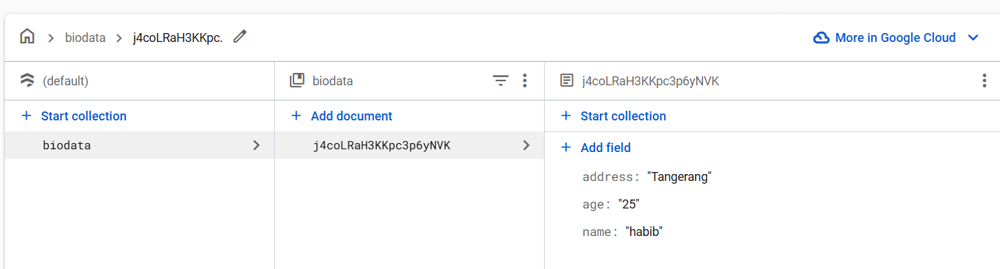

# 🚀 **Firebase Biodata CRUD in Flutter**  

Aplikasi Flutter simpel dan powerful untuk mengelola **biodata secara real-time** menggunakan **Firebase Firestore**. Tambah, edit, tampilkan, dan hapus data dengan mudah!  


---
ss :  
ss :  

## ✨ **Fitur Unggulan** 

✅ **Tambah Biodata** – Simpan nama, usia, dan alamat ke Firestore  
✅ **Tampilkan Data** – Lihat daftar biodata yang tersimpan secara real-time  
✅ **Edit Biodata** – Perbarui informasi biodata dengan mudah  
✅ **Hapus Data** – Hapus data hanya dengan sekali klik  

🔥 **Cepat, ringan, dan efisien!**  

---

## 🛠 **Teknologi yang Digunakan**  
🚀 **Flutter** – Framework UI canggih untuk aplikasi multi-platform  
☁️ **Firebase Firestore** – Database cloud real-time  
💡 **Dart** – Bahasa pemrograman yang cepat dan efisien  

---

## ⚙️ **Instalasi & Setup**  
1️⃣ **Integrasi Firebase ke Flutter**  
   - Buat proyek di **[Firebase Console](https://console.firebase.google.com/)**  
   - **Android**: Unduh `google-services.json` → Letakkan di `android/app/`  
   - **Web**: Unduh `firebase-options.dart` jika diperlukan  

2️⃣ **Jalankan Aplikasi**  
   ```sh  
   flutter pub get  
   flutter run  
   ```  

---

## 📂 **Struktur Proyek**  
```
/lib
│── main.dart           # Entry point aplikasi
│── homepage.dart       # UI utama untuk menampilkan & mengelola biodata
│── biodataservice.dart # Logika CRUD Firestore
│── widgets/            # (Opsional) Komponen UI tambahan
```  

💡 **Solusi sederhana untuk CRUD biodata yang efisien & mudah digunakan!** 🚀  
Jika ada saran atau fitur yang ingin ditambahkan, beri tahu saya! 😊
